# Pipeline Designer & Node Reference

The **Pipeline Design menu** serves as your visual toolbox. It provides the functional Nodes that you drag onto the workspace to architect your data flow. The menu is structured into distinct, logical categories.

## 1. Core Workflow Nodes

Located at the top (non-foldable), these nodes define the lifecycle of your pipeline:

*   **Start Node:** The mandatory "trigger" point.
*   **End Node:** The termination point that confirms the pipeline has completed its sequence.

## 2. 📥 Sources (Foldable)

This section contains the "Extract" components of your ETL/ELT.

### 🪣 Source Bucket Node
When you drag the Source Bucket node onto the canvas, it serves as the gateway for file-based ingestion. This node is highly adaptive, supporting both localized server storage and cloud environments.

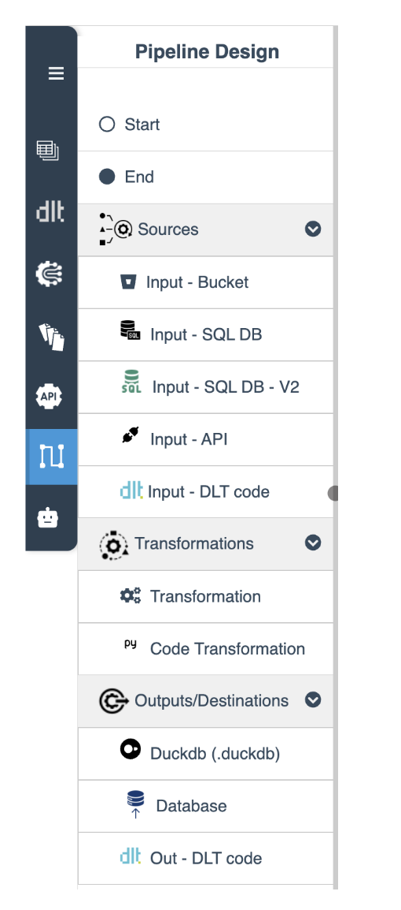{ width="25%" }

#### Storage Location (Primary Dropdown)
The first dropdown defines the environment where your files reside:
*   **From FS Folder:** This option loads files directly from the e2e-Data server. Currently, it points to the specific tenant folder assigned to your account. Future updates will expand this to allow connections to external file systems and other cloud providers.

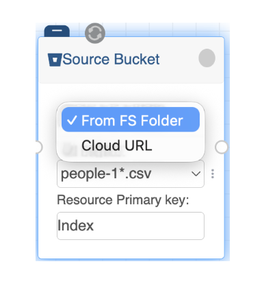{ width="30%" }

*   **Cloud URL:** This enables ingestion from a cloud-hosted bucket. By selecting this, you can specify a direct path to your data.

#### Cloud Configuration & Secrets
When the **Cloud URL** option is selected, an additional configuration layer appears:

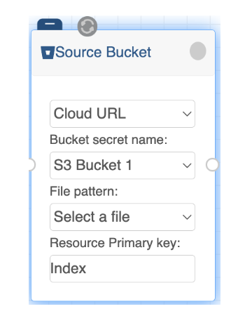{ width="30%" }

*   **Bucket Secret Name:** A new dropdown is displayed, listing all credentials specifically created for buckets in the Connections Catalog.
*   **Provider Support:** Currently, the platform supports Amazon S3. Support for additional cloud storage providers will be integrated as the platform evolves or as specific needs arise.

#### File Management & Deduplication
Regardless of the storage type selected, the node provides granular control over the specific data objects:
*   **File Pattern (Secondary Dropdown):** This dynamic list automatically populates with all files detected within the chosen FS folder or S3 bucket.
*   **Resource Primary Key:** This field allows you to manually specify the primary key for the rows within your file. Defining this is a best practice for handling data deduplication, ensuring that your destination remains clean even if the same file is processed multiple times.

### SQL DB v2 Source Node
The SQL DB v2 node is the standard component for relational database ingestion. It is designed to be highly interactive, fetching real-time metadata from your database to simplify the configuration process.

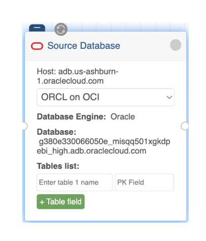{ width="30%" }

#### Core Configuration & Metadata
Once the node is dragged onto the canvas, the setup begins with your pre-defined security credentials:
*   **Secret Selection:** The primary dropdown lists all existing database secrets from your Connections Catalog.
*   **Dynamic Information:** Immediately after selecting a secret, the node validates the connection and displays key infrastructure details directly on the face of the node:
    *   **Host Address:** Shown at the very top for quick verification.
    *   **Database Engine:** Displays the specific engine type (e.g., Oracle, Postgres).
    *   **Database Name:** Shows the specific instance or schema name.
    *   **Engine Branding:** For easy visual identification, the specific logo of the database engine (e.g., the Oracle "red O") is displayed in the top-left corner of the node.

#### Interactive Table & Primary Key Selection
Instead of manual typing, the node provides an "auto-complete" experience for mapping your data:
*   **Table List:** You can add multiple tables to a single node by clicking the green **(+ Table field)** button.

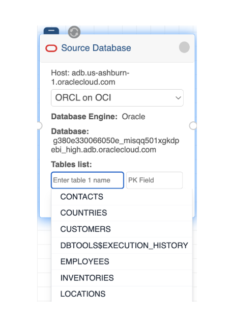{ width="30%" }

*   **Intelligent Discovery:**
    *   **List All:** Place your cursor in the "Enter table name" field and press the **Control (Ctrl)** key to see a full list of all available tables in that database.
    *   **Auto-complete:** Start typing a name, and the node will filter the available tables in real-time.
*   **Primary Key (PK) Mapping:** Once a table is selected, the **PK Field** dropdown becomes active. You can use the same approach (typing or pressing Control) to select the correct column for deduplication and incremental loading.

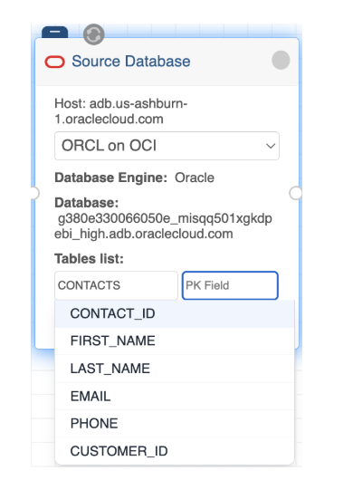{ width="30%" }

### 🌐 API Source Node
The API node is designed for rapid integration of web services into your pipeline. It abstracts the technical complexity of RESTful calls by pulling all necessary metadata directly from your pre-configured settings on API catalog.

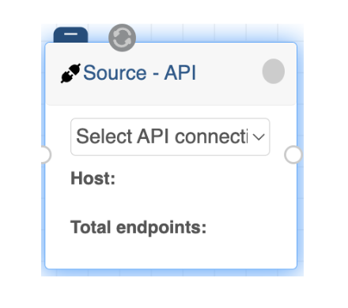{ width="30%" }

#### Effortless Configuration
Setting up the API node on the canvas is a single-step process:
*   **Secret Selection:** The only action required is to select the API Secret from the dropdown menu. This list is populated from the unique configurations you previously defined in the API Catalog.

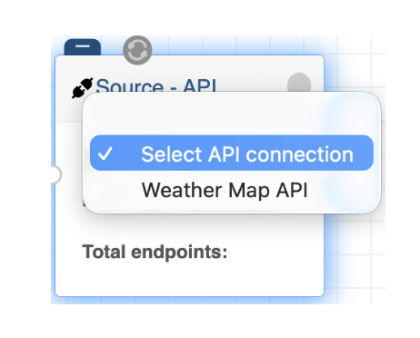{ width="30%" }

*   **Automatic Metadata Display:** Once a secret is selected, the node dynamically retrieves and displays key information for visual confirmation:
    *   **Host:** The base URL associated with the secret is shown at the top.
    *   **Total Endpoints:** The node indicates exactly how many endpoints are included in this configuration (e.g., "Total Endpoints: 3").

#### Integrated Logic
Because this node is linked to the API Catalog, it automatically inherits all backend logic without further manual input:
*   **Security:** Authentication (API Keys or Bearer Tokens) is handled securely via HashiCorp Vault.
*   **Data Structure:** Any Data Selectors or Primary Keys defined in the catalog are applied to the ingestion stream.
*   **Pagination:** If "Use pagination" was enabled in the catalog, the node will automatically handle the offset and limit logic during execution.
    *   *Note:* When this node is executed, the pipeline will simultaneously trigger requests to all endpoints defined under the selected secret, aggregating the data into your flow.

### DLT Code Source Node
The DLT Code node is the most flexible ingestion component in e2e-Data, designed for developers who need to implement custom logic using the dltHub framework and Python.

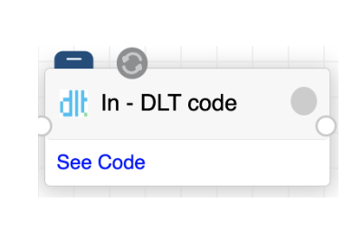{ width="30%" }

#### The Integrated Code Editor
By clicking the "See Code" link on the node, a dedicated code editor opens, allowing you to define your ingestion logic:

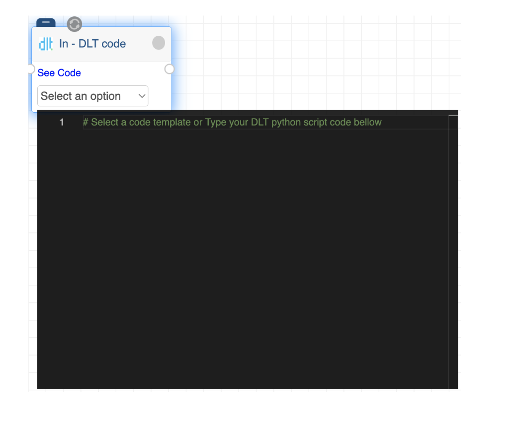{ width="70%" }

*   **Template Support:** The editor includes a dropdown menu containing all previously saved code templates. This allows you to quickly inject boilerplate code or reusable logic without manual typing.

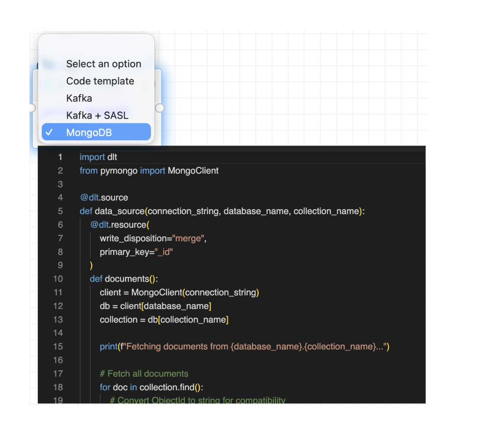{ width="70%" }

*   **Custom Development:** You can write and refine your Python code directly within the editor to handle complex data structures or non-standard sources.
*   **Best Practices:** To ensure compatibility with the pipeline engine, always use the `@dlt.source` and `@dlt.resource` decorators to annotate your logic correctly, and the resource need to be returned in the source level.

#### Security & Secret Management
To maintain security, never hardcode sensitive credentials like API keys or passwords directly in the editor.
*   **The `__secrets` Constant:** Instead of plain text passwords, reference your securely stored credentials using the `__secrets` constant in your code.
*   **Vault Integration:** The platform automatically retrieves these values from the HashiCorp Vault (configured in the Connections Catalog) and injects them at runtime, keeping them hidden from the UI.

#### Execution Security & Import Restrictions
For the safety of the server environment, e2e-Data enforces security policies on the Python code executed within these nodes:
*   **Restricted Statements:** Certain import statements and system commands are disabled by default to prevent unauthorized system access.
*   **Allowlisting:** If your specific logic requires a restricted library, it can be manually allowed in the application's core configuration before the e2e-Data server is deployed.
*   **Future Updates:** A dedicated UI section is planned for future releases to allow administrators to manage these code execution permissions directly within the platform.

## 3. 🔄 Transformation (Foldable)

Where data is refined, cleaned, and modeled.
*   **Visual Transformation:** A point-and-click interface for structural changes.
*   **Client Script:** Supports e2e-Data's custom language for specific logic.
*   **Live Preview:** Instantly see the impact of your changes on the data before saving.
*   **Note:** The Code Transformation node is currently in development.

*(See the Transformations section for detailed usage).*

## 4. 📤 Destinations (Foldable)

The "Load" stage of your pipeline.

### DuckDB Output Node
The DuckDB Output node is a high-performance destination component that allows you to store processed data directly on the e2e-Data server. It is designed for simplicity, often requiring minimal manual configuration by inheriting details from previous nodes in the pipeline.

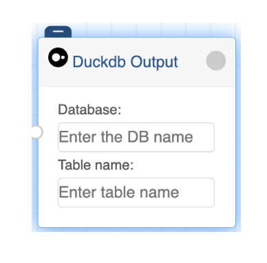{ width="30%" }

#### Configuration Fields
When you drag the DuckDB Output node onto the canvas, you define its identity through two primary fields:
*   **Database Name:** Assign a logical name to identify the dataset within the system.
*   **Table Name:** A name for the output table to keep your destinations organized.
*   **Automatic File Generation:** You do not need to specify a file path; the DuckDB database file is automatically created using the same name as your Pipeline, ensuring consistency across your workspace.

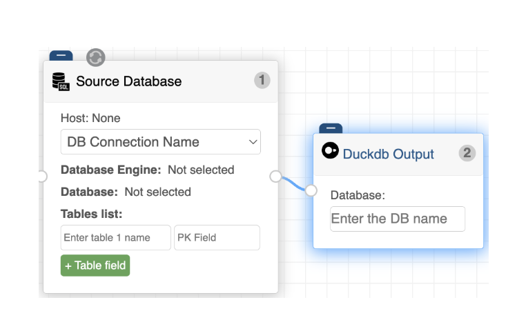{ width="50%" }

#### Smart Schema Inheritance
The node features intelligent UI adaptation based on your pipeline's source:
*   **SQL Source Integration:** If the source of your pipeline is a SQL Database, the DuckDB node automatically inherits the table names from the source selection.
*   **Dynamic UI:** To prevent configuration errors and save time, the table name field is automatically hidden when a SQL source is detected, as the system already knows which tables to create in the DuckDB file.

### Database Output Node
The Database Output node is the primary destination for structured data in your pipeline. Designed for a "plug-and-play" experience, it minimizes manual configuration by leveraging your existing catalog of secrets.

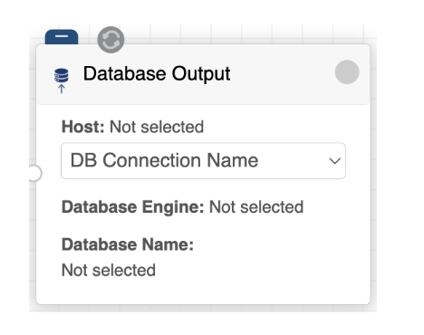{ width="30%" }

#### Streamlined Destination Setup
Configuration for this node is focused entirely on identifying the target system:
*   **Secret Selection:** The only required action is selecting the pre-configured DB Connection Name from the dropdown menu. This links the node to the credentials and connection strings stored in your catalog.

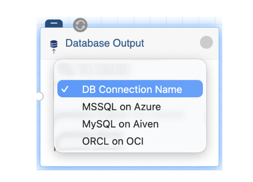{ width="30%" }

*   **Automatic Metadata Reflection:** Just like the source node, once a secret is selected, the node automatically populates and displays visual confirmation fields:
    *   **Host:** The destination server address.
    *   **Database Engine:** The type of database being written to (e.g., Oracle, MySQL).
    *   **Database Name:** The specific target database or schema.
*   **Unified Interface:** Because the node name is intentionally generic, it serves as a single, consistent component for various data architectures.

#### Future-Ready Compatibility
The node is built to be an all-encompassing destination for structured and semi-structured data:
*   **SQL Support:** It currently supports the same engines available in the SQL DB v2 source (Oracle, MySQL, MariaDB, Postgres, and MSSQL).
*   **NoSQL Integration:** While currently focused on relational systems, the Database Output node is designed to integrate NoSQL databases in upcoming releases, allowing you to switch between different database paradigms simply by changing the selected secret.

### DLT Code Output Node
The DLT Code Output node is the counterpart to the input version, providing a high-degree of customization for how data is written to a final destination. While the interface is identical to the input node, its functional focus is exclusively on the "Load" phase of your pipeline.

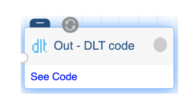{ width="30%" }

#### The Output Editor & Templates
By clicking the "See Code" link, you access a specialized environment for defining your write logic:
*   **Exclusive Output Templates:** The dropdown menu in this node contains templates specifically designed for data delivery. These templates focus on specifying where and how data is materialized in your target system.
*   **Flexible Logic:** You can use an existing template to quickly set up a standard destination, modify it to fit your needs, or create and save your own custom templates. This eliminates the need to rewrite the same connection or loading logic across multiple pipelines.

#### Security via `__secrets`
Just like the input node, security is handled through abstraction:
*   **Credential Protection:** You should never include raw passwords or secret keys in your output scripts.
*   **Safe Referencing:** Create your secrets in the Connections Catalog first, then reference them using the `__secrets` constant. This ensures your code remains clean and your credentials stay encrypted within the HashiCorp Vault.

#### Execution & Environment
*   **Import Restrictions:** For server security, certain Python statements and imports are restricted by default.
*   **Future Configuration UI:** While these restrictions are currently managed at the server level (before deployment), a future UI update will allow you to manage allowed imports and libraries directly from the platform's settings.
