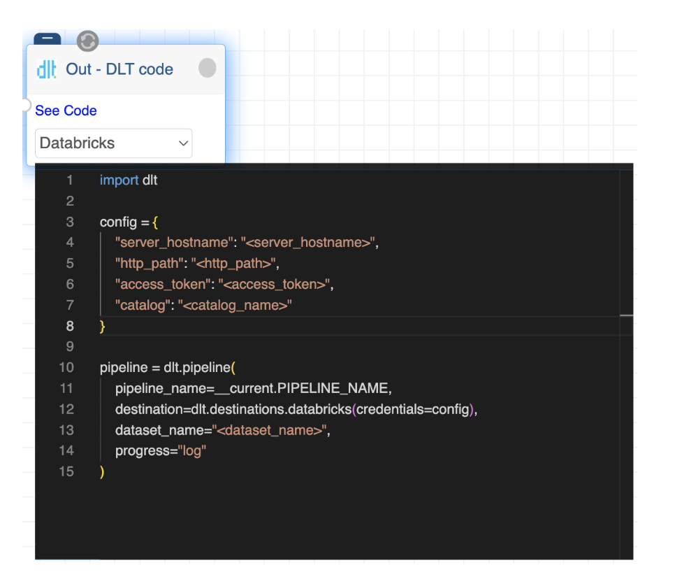
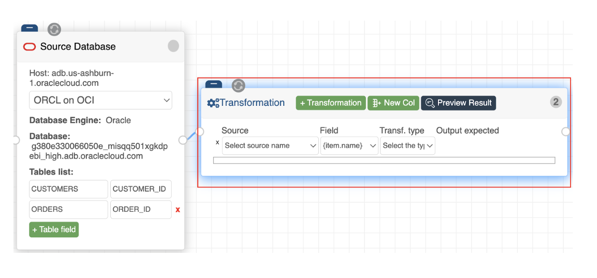
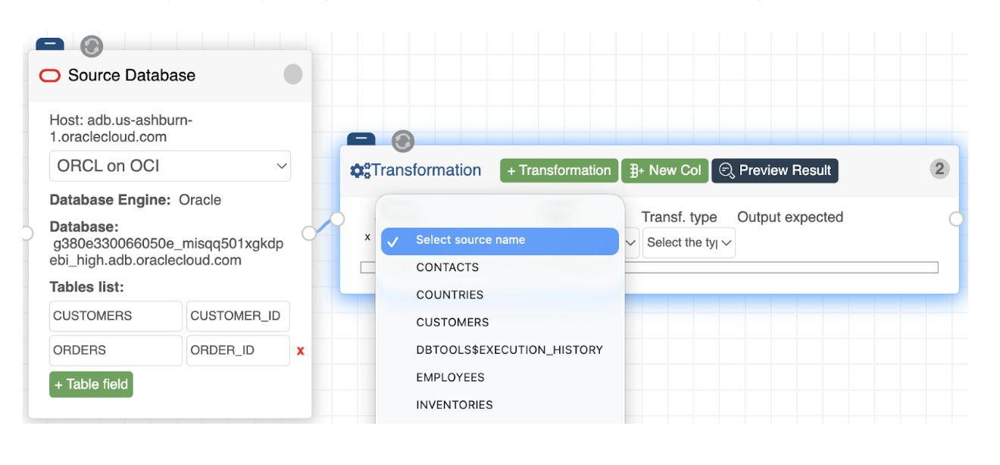
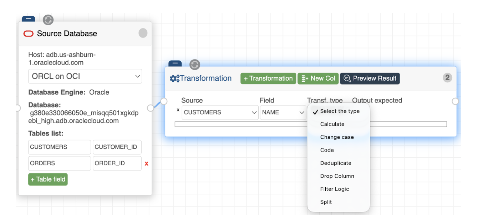
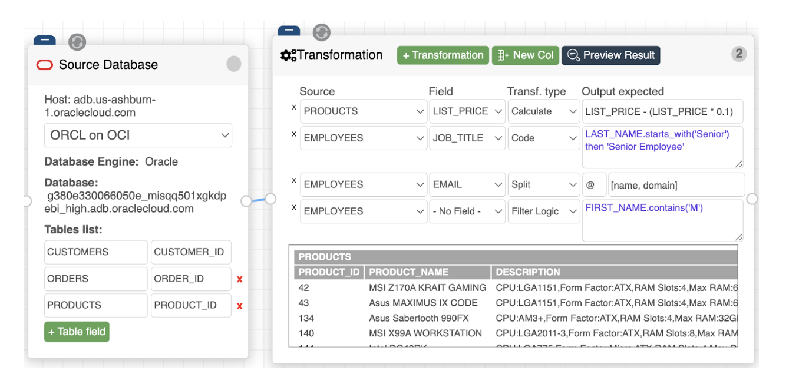

# Transformations

The **Visual Transformation node** is the engine where data is cleaned, modeled, and enriched. It features a "point-and-click" interface designed for structural changes without requiring complex external coding, while still offering a "Client Script" option for precision logic.

{ width="70%" }

## Schema Inference & Mapping

The node is highly intelligent and automatically recognizes the structure of your incoming data:
*   **Supported Sources:** Currently compatible with SQL Databases and Bucket/File Systems (supporting CSV, JSONL, and Parquet formats). Other source supports are being implemented.
*   **Automatic Discovery:** It automatically infers the schema from your connected source node, dynamically listing all available tables and their corresponding fields.

## Transformation Workflow

To apply a change, you follow a logical, step-by-step row selection:

1.  **Select Table:** Choose which source table you are working on.

{ width="50%" }

2.  **Select Field:** Choose the specific column/field to be modified.

{ width="50%" }

3.  **Transformation Type:** Select from the 8 available types (7 listed in the primary dropdown plus the "Add New Field" action).

{ width="50%" }

4.  **Define Logic:** Specify the exact transformation (e.g., converting text to uppercase, applying a mathematical operation, or applying custom business logic through Client Script).

{ width="70%" }

### Action Toolbar (Top Buttons)

The buttons at the top of the node provide three essential administrative actions:
*   **Add Transformation Row:** Adds a new row to the list to transform an existing source field.
*   **Add New Field:** Creates an entirely new column that will appear in your destination. When adding a field, you must name it and specify its logic, such as:
    *   **Formula:** For standard calculations.
    *   **Client Script:** To write custom logic using e2e-Data's proprietary language.
*   **Preview Transformations:** Allows you to see a live preview of all added transformations, ensuring the results are correct before the pipeline runs.

## Transformation Types

The Visual Transformation node currently supports **8 powerful transformation types**. These allow you to shape your data, enforce quality, and derive new insights through a simple interface.

### 1. Calculate (Numeric)
Used for mathematical operations on numeric fields. You can reference existing fields to create new values or update current ones.
*   **Example:** Applying a 10% discount to a product catalog.
*   **Logic:** `LIST_PRICE - (LIST_PRICE * 0.1)`
*   **Result:** The `LIST_PRICE` column is updated to reflect the discounted value.

### 2. Change Case (String)
A quick formatting tool for text-based columns.
*   **Options:** Convert values to **UPPERCASE** or **lowercase**.
*   **Use Case:** Standardizing user-inputted data (like emails or names) for consistent joining and reporting.

### 3. Code (Client Script) (Logic & Data Quality)
This provides the highest level of flexibility for both simple and complex logic using e2e-Data's custom script. It uses a clean, readable syntax for conditional logic and data quality handling.
*   **Example:** Identifying seniority based on a name prefix.
*   **Logic:** `LAST_NAME.starts_with('Senior') then 'Senior Employee' else JOB_TITLE`
*   **Syntax Rule:** Note that all strings in the script must be wrapped in single quotes (`'`), not double quotes.
*   **Error Handling:** If there is a syntax or runtime error in your script, it is detected automatically and will be clearly visible in the UI so you can fix it immediately.

### 4. Split (String Parsing)
Allows you to break a single field into multiple new columns based on a specific character (delimiter).
*   **Example:** Extracting information from an email address using the `@` character.

{ width="50%" }

*   **Result:** One field becomes two: the left side becomes a name field and the right side becomes a domain field.

### 5. Filter Logic (Row Control)
Unlike other transformations, this does not modify the content of a column; instead, it controls which rows are passed to the destination.
*   **Example:** Filtering for specific names.
*   **Logic:** `FIRST_NAME.contains('M')`
*   **Result:** The output will only include records where the `FIRST_NAME` contains the character `'M'`.

### 6. Deduplicate (Data Quality)
Ensures your dataset is unique based on a specific field.
*   **Function:** It identifies and removes duplicate rows based on the column you select (e.g., removing multiple entries for the same `STUDENT_ID`).

### 7. Drop (Schema Management)
Used to clean up your destination schema by removing unnecessary columns.
*   **Function:** Deletes the specified field from the dataset so it is not written to the final output.

### 8. Add New Field (Structural)
Allows you to create a completely new column from scratch.
*   **Setup:** You define the **New Field Name** and then assign its logic using one of the other types, such as a **Formula** or a **Code - Client Script**.
