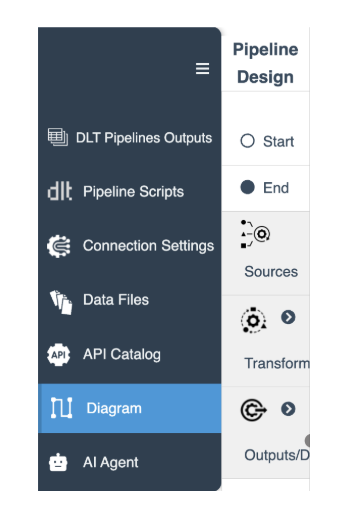
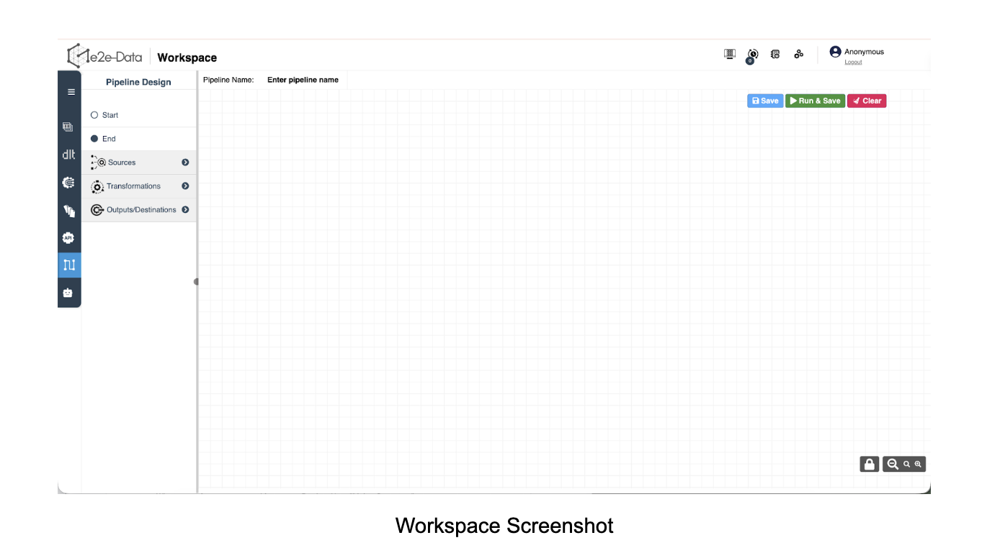
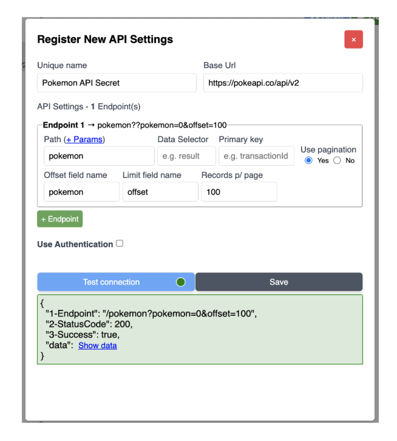
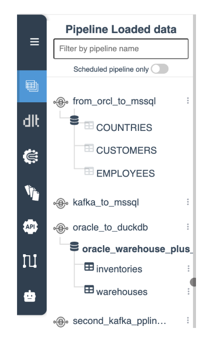
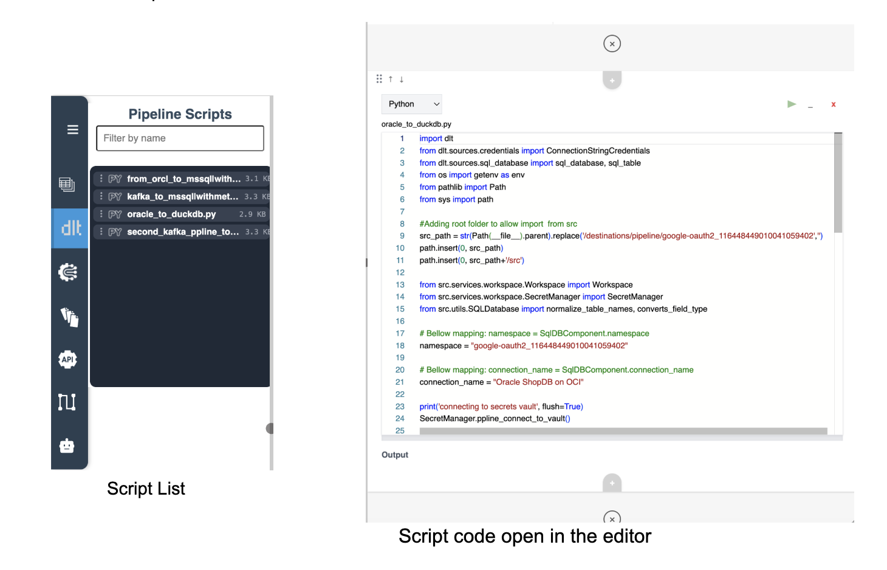
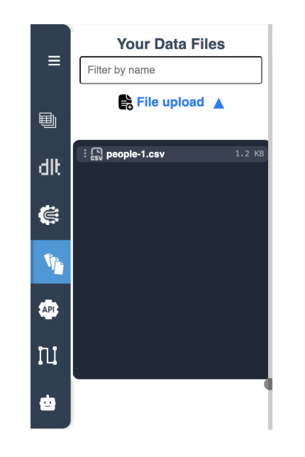

# The Workspace Interface

## 1. Primary Navigation (The Left Drawer)

The far-left blue ribbon can be expanded to reveal the primary functional areas of the platform. This drawer allows you to switch contexts without losing your progress on the canvas.

*   **DLT Pipelines Outputs:** View the results, data samples, and destination schemas of your executed flows.
*   **Pipeline Scripts:** Access the auto-generated Python and dltHub code that powers your visual diagrams.
*   **Connection Settings:** Centrally manage your credentials, secrets, and connection strings (e.g., SQL DB connection parameters).
*   **Data Files:** Manage flat files (e.g., Parquet, CSVs, JSONL) used as local data sources for your pipelines.
*   **API Catalog:** Document and manage external REST endpoints to be utilized within the workspace.
*   **Diagram:** Your primary workspace for building and connecting nodes on the canvas.
*   **AI Agent:** Invoke the AI Architect to help draft diagrams or explain pipeline logic.

{ width="25%" }

{ width="80%" }

## 2. The Secondary Menu (Diagram - The Node Palette)

When the **Diagram** view is active, the secondary menu expands to show the "toolbox." Every item here is a Code-Powered Node that brings optimized logic to the canvas.

{ width="50%" }

*   **Start/End:** Define the logical entry and exit boundaries of your process.
*   **Sources:** Drag-and-drop input origins such as `Input - Bucket`, `Input - SQL DB`, `Input - API`, or `DLT code` for pure dltHub and Python code node type.
*   **Transformations:** Access functional blocks like `Transformation` to manipulate data mid-stream.
*   **Outputs/Destinations:** Define your landing zone, such as `DuckDB`, a centralized Database, or direct `DLT code` output.

## 3. DLT Pipeline Outputs Menu

This menu provides a transparent view of your loaded data and destination schemas.

{ width="25%" }

### Dynamic Hierarchy
The menu adapts its structure based on your destination:
*   **DuckDB:** Displays a full three-tier hierarchy including the Pipeline Name at the top level, followed by the Database Name, and finally the individual Tables.
*   **Other Scenarios:** For non-DuckDB destinations, the menu simplifies the view to display only the Table Names under the pipeline.

### Example Workflow
As seen in the interface, pipelines like `from_orcl_to_mssql` demonstrate complex flows, such as pulling data from Oracle and writing it into SQL Server.

### Search & Filter
*   **Filter by pipeline name:** Use the input field to quickly locate specific workflows in a dense list.
*   **Scheduled View Toggle:** Use the "Scheduled pipeline only" toggle to isolate and manage only your active, automated runs.

### DuckDB Querying
For DuckDB destinations, you can interact with your data directly within the workspace.
1.  Click the three dots (⋮) next to a table to open the action menu.
2.  Select **Query** to execute SQL commands straight from e2e-Data.

> **Note:** While direct querying is currently exclusive to DuckDB, support for querying other destinations is planned for future releases.

## 4. Pipeline Scripts Menu

The Pipeline Scripts menu provides direct access to the auto-generated Python and dltHub code that powers your visual diagrams.

{ width="80%" }

*   **Script Inventory:** This menu lists the file scripts for all created pipelines in your workspace (e.g., `oracle_to_duckdb.py`).
*   **In-App Code Editor:** You can view and edit the code directly within e2e-Data. To do so:
    1.  Click the three dots (⋮) next to the desired script.
    2.  Select **Open Editor** from the dropdown menu to launch the built-in code editor.
*   **Download Scripts:** For local development or external deployment, every script can be downloaded directly from this menu.
*   **Search & Filter:** Easily locate specific scripts by typing in the "Filter by name" input at the top of the menu.

## 5. Data Files Menu

The Data Files menu allows you to manage the local sources used within your diagrams.

{ width="25%" }

*   **Upload Interface:** You can add files to your workspace by using the "Choose File" button to browse or by simply dragging and dropping your file directly into the upload area.
*   **File Management:** Organize and filter your flat files, such as Parquet, CSVs, and JSONL, to be utilized as local data sources.
*   **Canvas Integration:** Once uploaded, these files become available in the **File pattern** dropdown of your **Source nodes** of type `Bucket` on the interactive canvas.

## 6. The Interactive Canvas & Operations

The central grid is an infinite design space where you architect the flow.

### Canvas Tools
Use the bottom-right icons to **Lock** your diagram (preventing accidental moves) or **Zoom** for a better view of large-scale pipelines.

### Action Center (Top Right)
*   **📊 Monitor:** Toggle the display of real-time execution logs.
*   **📅 Schedule:** Access the list of scheduled pipelines.

### Pipeline Action
*   **🚀 Run & Save:** Run and Save the pipeline.
*   **Save:** Save the pipeline so it can be scheduled for running later.
*   **Clear:** Clear the canvas if any diagram is active.
