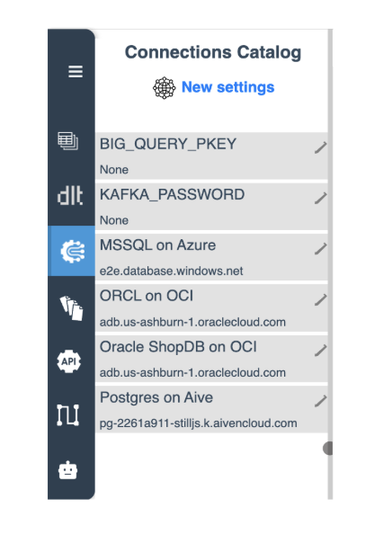
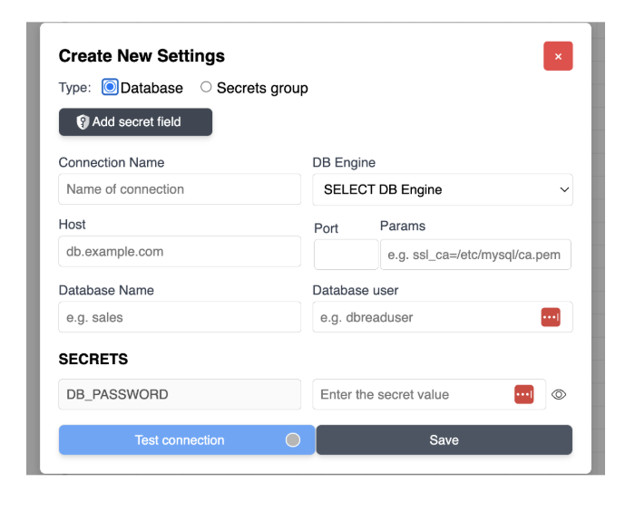
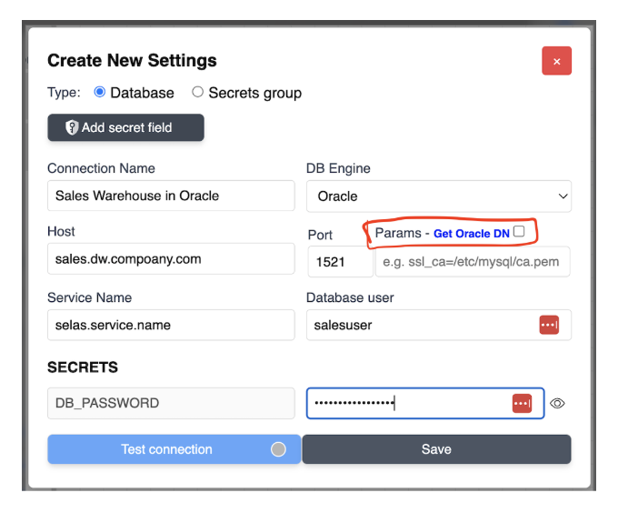
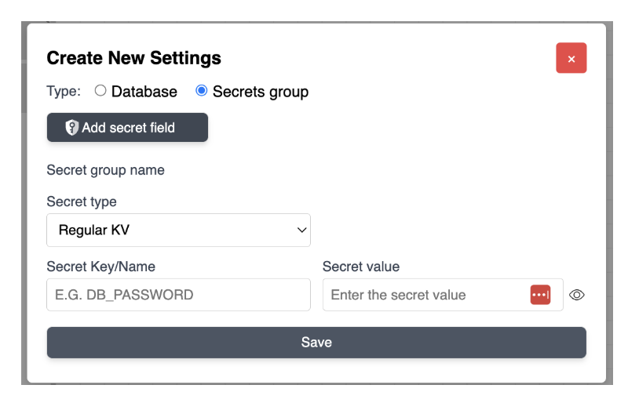
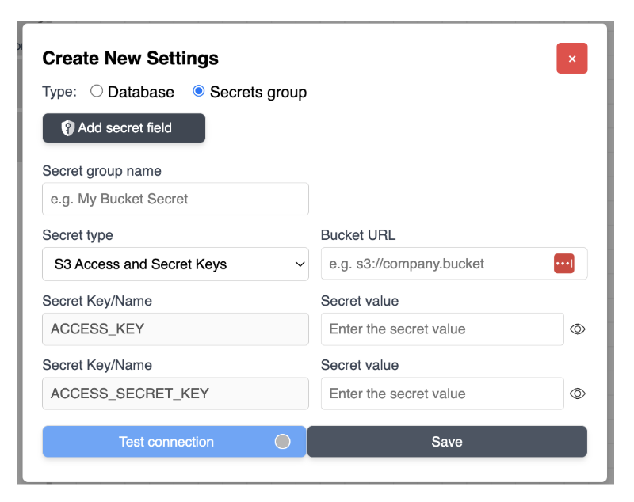
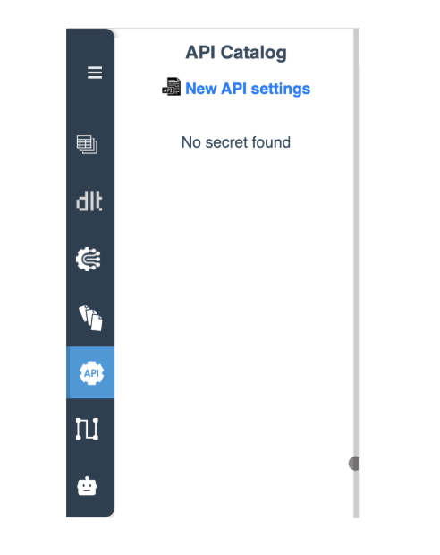
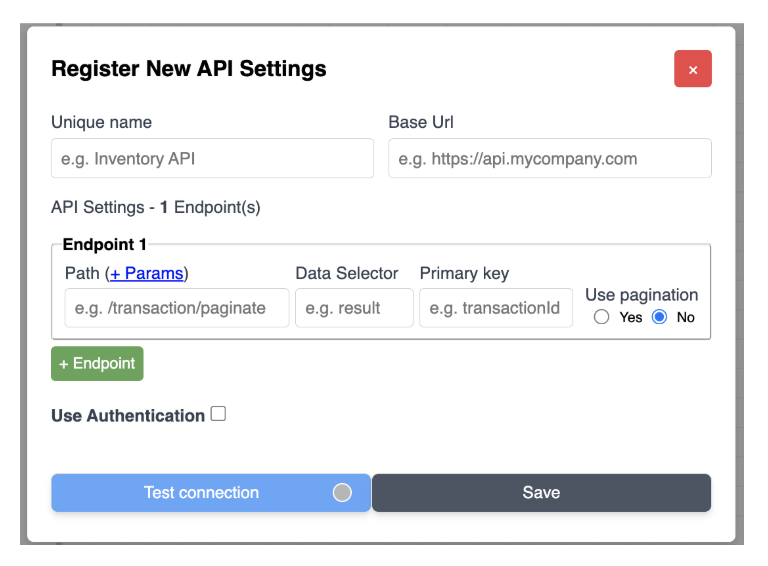
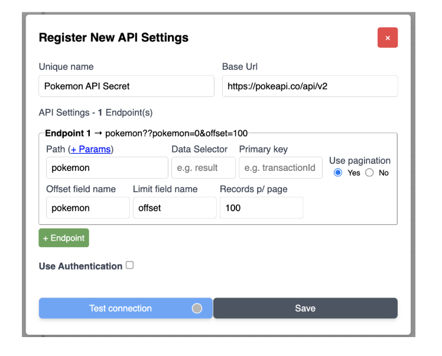
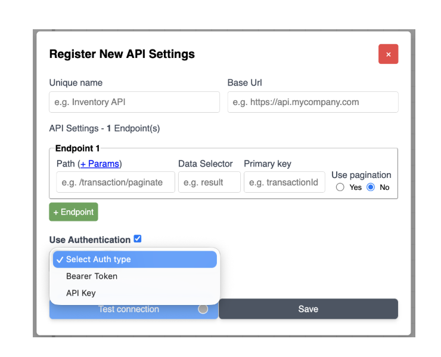
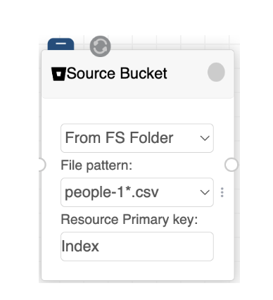

# Gestor de Segredos: Ligações & Catálogos de API

O **Gestor de Segredos** do e2e-Data é uma camada de segurança robusta construída sobre o [HashiCorp Vault](https://www.vaultproject.io/). Foi desenhado para ser muito flexível, suportando tanto a versão HashiCorp Cloud como instâncias self-hosted (on-prem ou na tua própria VPC cloud). Este sistema garante que credenciais sensíveis, desde palavras-passe de bases de dados a tokens de API, ficam abstraídas do canvas visual e são injetadas com segurança no motor dltHub em tempo de execução.

## 1. Catálogo de Ligações (Segredos de Infraestrutura)

O **Catálogo de Ligações** trata das credenciais centrais do teu ambiente de dados.

{ width="25%" }

*   **Visibilidade:** Para Grupos de Segredos de Base de Dados ou de Plataforma, a interface mostra o **Nome da Ligação** e o **endereço do Host**.
*   **Segredos sem Host:** Para segredos gerais onde não existe host, o campo mostra `None`.

### Criar Novas Definições de Base de Dados

Ao selecionar o tipo **Database** no formulário "Create New Settings", podes configurar ambientes SQL como Oracle, MSSQL, Postgres, MySQL/MariaDB.

{ width="40%" }

#### Campos de Configuração
*   **Connection Name:** Um identificador único usado para referenciar estas credenciais no código do teu pipeline.
*   **DB Engine:** Menu suspenso para selecionar o tipo de base de dados de destino.
*   **Host/Port/Database Name:** Identificadores padrão de rede e esquema.
*   **Database User/Secrets (Password):** Credenciais seguras de acesso.
*   **Params:** Usado para parâmetros adicionais.

#### Específico do Oracle: Connection Descriptor (CD) Gerado Automaticamente
Para bases de dados Oracle, o e2e-Data simplifica configurações complexas gerando automaticamente o Connection Descriptor quando necessário (por exemplo, ao usar Oracle na OCI).

{ width="40%" }

1.  Preenche primeiro os campos padrão (Host, Port, Service Name).
2.  **Geração:** Clica na caixa de seleção junto à etiqueta **Params**.
3.  **Resultado:** O sistema preenche automaticamente o campo Params.

### Verificação & Certeza
*   **Test Connection:** Clica sempre no botão azul **Test connection** antes de guardar. Isto valida o handshake (incluindo o CD gerado, caso exista).
    *   O círculo cinzento passa a **verde** em caso de sucesso, e a **vermelho** em caso de falha.
*   **Save:** Depois de validadas, grava as definições no HashiCorp Vault.

## 2. Criar Grupos de Segredos (KV & Chaves de Fornecedores)

A opção **Secrets group** permite-te gerir credenciais que não são de bases de dados, como variáveis de ambiente ou chaves de fornecedores cloud.

{ width="40%" }

*   **Convenção de Nomes:** É boa prática definir as chaves de segredos em **MAIÚSCULAS** (por exemplo, `ACCESS_KEY`).
*   **Value (mascarado):** Por segurança, os valores dos segredos aparecem mascarados por defeito na interface.
*   **Templates de Fornecedores:** Usa o menu suspenso "Secret type" para selecionar templates pré-configurados.
    *   **Implementação S3:** Ao selecionar S3 Access and Secret Keys, são fornecidos automaticamente campos para `ACCESS_KEY`, `ACCESS_SECRET_KEY` e o URL do Bucket.

{ width="40%" }

*   **Validação Integrada:** Tal como nas definições de Base de Dados, as Chaves de Fornecedores também têm um botão **Test connection**. Isto permite verificar se as credenciais e o URL do Bucket estão corretos antes de o segredo ser guardado no Vault.

## 3. Catálogo de APIs (Segredos de Web Services)

O **Catálogo de APIs** é um gestor de segredos especializado dentro do e2e-Data, desenhado especificamente para aquisições RESTful. Centraliza os parâmetros complexos necessários para a comunicação com web services, mantendo seguros os tokens de autenticação.

{ width="25%" }

### Registar Novas Definições de API

Ao criar uma nova configuração de API, é-te apresentado um formulário que gere tanto a acessibilidade como a estrutura dos dados que queres obter.

{ width="40%" }

*   **Unique Name:** Tal como os segredos de infraestrutura, cada configuração de API requer um nome único.
*   **Base URL:** O endereço raiz do serviço de API (por exemplo, `https://api.mycompany.com`).
*   **Suporte a Múltiplos Endpoints:** Por defeito, é fornecido o "Endpoint 1". Ao clicar no botão verde **(+ Endpoint)**, podes adicionar vários endpoints a uma única configuração.
    *   **Efeito:** Quando esta definição de API é atribuída a um nó de origem de um pipeline, todos os endpoints configurados são incluídos no pedido de dados.

### Estrutura de Dados & Deduplicação

Para cada endpoint, podes definir como o e2e-Data deve interpretar a resposta JSON recebida:

*   **Data Selector:** Usa-o se a resposta da API vier "embrulhada" num campo específico.
    *   *Exemplo:* Se a resposta for `{"students": [{"name": "Mario"}]}`, introduzir `students` como seletor garante que o sistema obtém a lista diretamente.
*   **Primary Key:** Usada para tratar cenários de deduplicação, garantindo que os registos únicos são corretamente identificados e não duplicados no teu destino.

### Configuração de Paginação por Offset

Se o teu endpoint o suportar, podes tratar grandes volumes de dados selecionando **Yes** em "Use pagination". Isto revela campos específicos para gerir o fluxo:

*   **Offset field name:** O parâmetro que a API usa para saltar registos (por exemplo, `offset`).
*   **Limit field name:** O parâmetro que a API usa para definir o tamanho da página (por exemplo, `limit`).
*   **Records p/ page:** O valor atribuído ao campo Limit (por exemplo, `100`).
*   **Nota:** O campo Offset tem 0 por defeito, mas podes substituí-lo para inícios personalizados. Por exemplo, `pokemon=20` iniciaria a obtenção de dados a partir do registo 20.

### Autenticação & Segurança

Gere com segurança a forma como o e2e-Data prova a sua identidade ao fornecedor da API. Ao marcar **Use Authentication**, podes escolher no menu suspenso Auth type:
*   **X-API-Key:** Para autenticação por chave em cabeçalho.
*   **Bearer Token:** Para segurança baseada em token padrão.
*   **Proteção do Vault:** Estes valores são mascarados na interface e guardados com segurança na tua instância do HashiCorp Vault.

{ width="40%" }

### Verificação & Teste de Ligação

Para garantir que a tua configuração funciona antes de guardar, usa o botão azul **Test connection**. Isto executa uma verificação de validação para cada endpoint configurado.

{ width="40%" }

{ width="25%" }

*   **Sucesso:** Se todos os endpoints forem válidos, o indicador de estado passa a verde e aparece um resumo JSON para cada endpoint.
*   **Lógica de Falha:** Se um único endpoint falhar a validação, o indicador passa a vermelho, mesmo que os restantes sejam válidos. Esta abordagem de tudo-ou-nada evita instalações com endpoints parcialmente quebrados.
