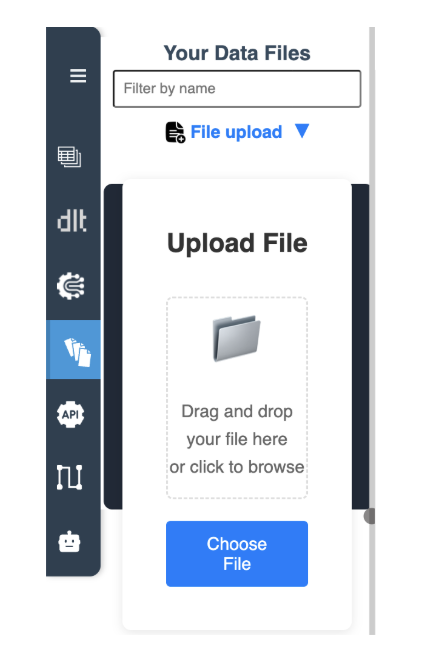
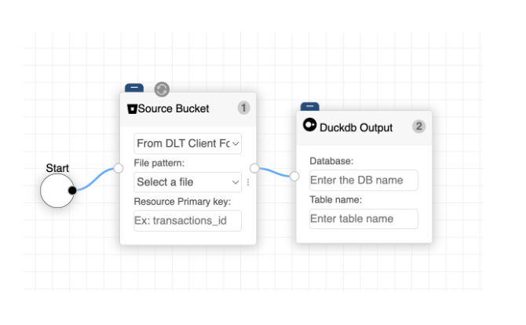
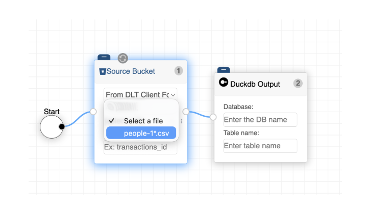
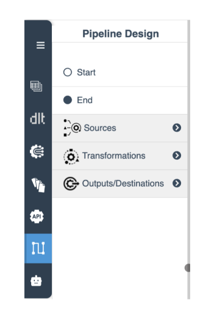

# Guia Rápido: O Teu Primeiro Pipeline

Este guia vai orientar-te na construção de um pipeline de dados fundamental: extrair dados de um ficheiro CSV e carregá-los numa base de dados DuckDB.

## Passo 0: Configurar o Ambiente

Antes de construir, garante que tens acesso ao workspace do e2e-Data. Tens duas opções:

*   **Configuração Local:** Configura o e2e-Data no teu ambiente de desenvolvimento local para controlo total.
*   **Sandbox na Cloud:** Cria uma conta online limitada para começar a construir imediatamente sem instalação.

!!! info "Ver: Configurar o Ambiente de Desenvolvimento e2e-Data"
    [Video Placeholder: Setting up the e2e-Data Dev Environment for local testing](https://www.google.com/search?q=https://your-video-link&authuser=2)

## Criar um Pipeline de CSV para DuckDB

Segue estes passos para arquitetar o teu primeiro fluxo.

### 1. Preparar o Ficheiro de Dados

Antes de construir o diagrama, precisas de disponibilizar os teus dados na plataforma.

1.  Abre a **Navegação Principal** (Faixa Azul) e seleciona **Ficheiros de Dados**.
2.  **Carregar:** Podes clicar para procurar ou simplesmente arrastar e largar o teu ficheiro diretamente na área de upload.

{ width="25%" }

### 2. Arquitetar o Diagrama

Muda para a vista de **Diagrama** na Navegação Principal para começar a desenhar.

1.  **Colocar Nós:** Arrasta os seguintes nós do **Menu Secundário** para o canvas:
    *   Nó `Start` (da categoria **Start/End**).
    *   `Input - Bucket` (da categoria **Sources**).
    *   `Duckdb (.duckdb)` (da categoria **Outputs/Destinations**).
2.  **Ligar os nós:** Clica na porta de saída de um nó e arrasta uma linha para a porta de entrada do próximo para estabelecer o fluxo: `Start` ➔ `Source Bucket` ➔ `Duckdb Output`.

{ width="50%" }

### 3. Configurar os Nós

Uma vez ligados, deves dizer aos nós que dados específicos devem manipular.

1.  **Selecionar um ficheiro:** Clica no nó `Source Bucket` no canvas.
2.  **Padrão de Ficheiro:** No menu suspenso do nó, verás uma lista de todos os teus ficheiros carregados. Seleciona o teu ficheiro `.csv`.
3.  **Definir Destino:** Clica no nó `Duckdb Output` e insere o **Nome da Base de Dados** e **Nome da Tabela** desejados.

{ width="50%" }

### 4. Executar e Monitorizar

1.  **Executar:** Clica em **Run & Save** no Centro de Ação no canto superior direito.
2.  **Logs em Tempo Real:** O ecrã de **Monitor** abrir-se-á automaticamente, mostrando os logs de execução em tempo real. O e2e-Data gera a lógica Python/dlt necessária e processa o teu ficheiro instantaneamente.

{ width="25%" }

!!! info "Ver: Tutorial Básico de CSV para DuckDB"
    [Video Placeholder: Basic CSV to DuckDB Tutorial](https://www.google.com/search?q=https://your-video-link&authuser=2)

## ✅ Verificar os teus Dados

Após os logs confirmarem uma execução com sucesso, navega para **DLT Pipelines Outputs** na Navegação Principal. Aqui, podes inspecionar a pré-visualização final dos dados e garantir que a tabela DuckDB foi criada com o esquema correto.
